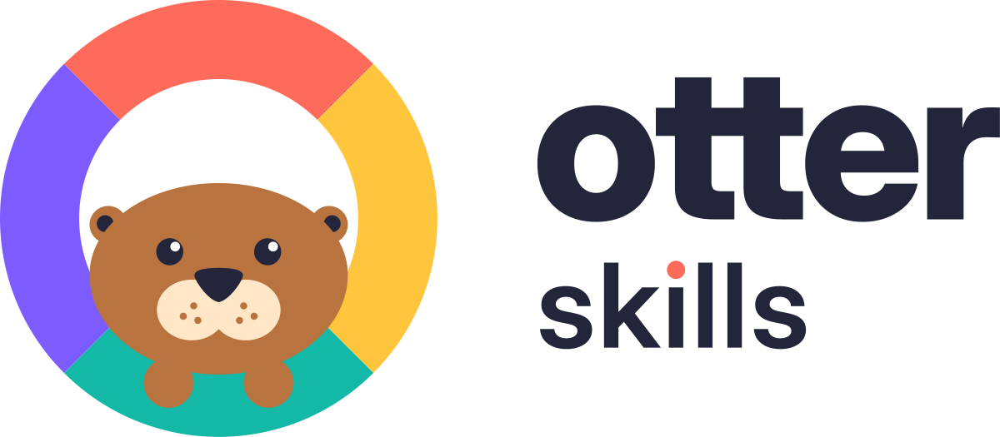

# Otter Skills — logo guidelines



## 1. The logo

**Idea:** the `o-` of every skill drawn as a lifebuoy, with an otter floating in it, paws on the rim. Otters are
tool users; the four colours of the ring are the many skills it carries.

| Version | Use it for | File |
|---|---|---|
| Horizontal (primary) | README, website header, docs | `svg/otter-skills-horizontal.svg` |
| Stacked | Square-ish spaces, slides, social cards | `svg/otter-skills-stacked.svg` |
| Symbol | Avatars, stickers, anywhere the name is already present | `svg/otter-skills-symbol.svg` |
| Symbol, small cut | Everything under 64 px: favicons, tab icons, tiny avatars | `svg/otter-skills-symbol-small.svg` |
| Wordmark | Places where the symbol already appears nearby | `svg/otter-skills-wordmark.svg` |
| Banner | README header (light and dark) | `svg/otter-skills-banner.svg`, `svg/otter-skills-banner-dark.svg` |

Every version has an `-on-dark` file (white type, ~5 % lighter weight so it does not glow heavier on dark). One-colour
files — `-black`, `-white`, `-ink` — use real cut-outs, so they work on any background, in print, embroidery and
laser engraving. PNG exports are in `png/`, the web icon set in `web/`.

## 2. Clear space

Keep a clear zone of **one ring band** around the logo on every side — the band is the thickness of the coloured
ring (about 18 % of the symbol's diameter). It scales with the logo; never use a fixed distance.

## 3. Minimum size

| Version | Screen | Print |
|---|---|---|
| Horizontal | 120 px wide | 30 mm wide |
| Wordmark | 100 px wide | 25 mm wide |
| Symbol (full detail) | 64 px | 16 mm |
| Symbol, small cut | 16 px | 6 mm |

Below 64 px, always switch to the small cut — the full symbol's whisker dots and eye highlights turn to mush.

## 4. Colour

| Name | Role | HEX | RGB | CMYK (starting point) |
|---|---|---|---|---|
| Ink | Type, eyes, nose, one-colour logo | `#23263A` | 35 38 58 | 40 34 0 77 |
| Coral | Ring (top), the dot on the i | `#FF6B5B` | 255 107 91 | 0 58 64 0 |
| Sun | Ring (right) | `#FFC53D` | 255 197 61 | 0 23 76 0 |
| Teal | Ring (bottom) | `#14B8A6` | 20 184 166 | 89 0 10 28 |
| Grape | Ring (left) | `#7C5CFF` | 124 92 255 | 51 64 0 0 |
| Otter | Fur | `#B9733F` | 185 115 63 | 0 38 66 27 |
| Cream | Muzzle | `#FFE6C7` | 255 230 199 | 0 10 22 0 |
| Paper | Light backgrounds, app-icon tile | `#FFF8EF` | 255 248 239 | 0 3 6 0 |
| Night | Dark backgrounds | `#1B1D2C` | 27 29 44 | 39 34 0 83 |

CMYK values are a direct conversion — proof them on press before a print run. No Pantone references are specified
yet; match on press if a spot colour is needed. Grape (#7C5CFF) is a vivid RGB violet that CMYK cannot fully reach.

**Approved logo/background pairs:** full colour on white, Paper or Night · `-on-dark` files on Night or any dark
surface · `-white` on a single brand colour or photo · `-black` / `-ink` on white for one-colour print.

**Text colour:** set body text in Ink (14.9 : 1 on white). Coral, Sun and Teal are below 3 : 1 on white — use them
for shapes and accents, never for text on light backgrounds.

## 5. Typography

- The wordmark is **Inter Display**, outlined (no live text): `otter` at weight 800, `skills` at 600, optical size
  32; on dark 762 / 572. The tittle of the *i* is a Coral circle, the one custom letter.
- Licence: SIL Open Font License 1.1 — free for logos and commercial use.
- Companion type for docs and slides: Inter (or Inter Display for headings) · fallback
  `Inter, system-ui, -apple-system, "Segoe UI", sans-serif`.

## 6. Don'ts

Don't stretch, squash or rotate the logo · don't recolour the ring or reorder its colours · don't add shadows,
outlines, gradients or glows · don't separate the otter from the ring · don't resize or move the parts of a lockup ·
don't use the full symbol below 64 px (use the small cut) · don't place the colour logo on busy photos — use
`-white` or `-black` · don't retype the wordmark — use the files.

## 7. Using it

**README header** (switches with GitHub's light/dark theme):

```html
<picture>
  <source media="(prefers-color-scheme: dark)" srcset="docs/brand/svg/otter-skills-banner-dark.svg">
  
</picture>
```

**GitHub social preview:** upload `png/otter-skills-social-1280x640.png` in *Settings → General → Social preview*.

**Website:** copy `web/` to the site root and paste `web/head-snippet.html` into `<head>`.

## 8. Source

`source/kit.py` rebuilds every SVG from one set of parameters (`source/refine.py`, variant `r2`), so the variants
cannot drift apart. It needs Python 3 with `skia-pathops` and `uharfbuzz`, and Inter Variable installed:

```bash
python3 -m venv .venv && .venv/bin/pip install skia-pathops uharfbuzz
cd docs/brand/source && ../../../.venv/bin/python kit.py ../svg
```

Trademark: no clearance search has been run. Do one (USPTO / EUIPO / WIPO and a reverse image search) before
using the mark beyond the repository — "Otter" names exist in the AI space.
